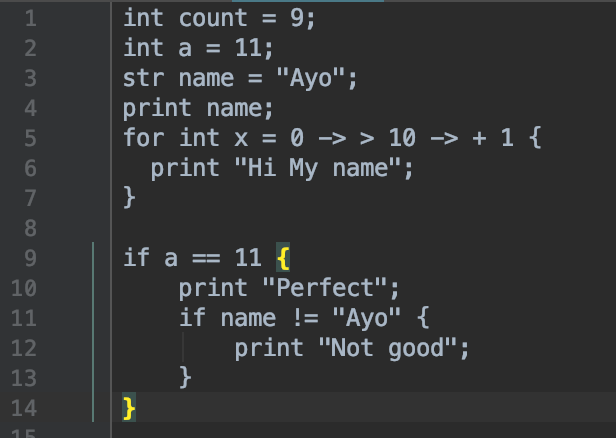

# Fluffy 🐰  
This is my own interpreter programming called Fluffy.

# UPDATE!!!!
Fluffy v2 is broken like so broken I can't fix it. So I'm just going to jump to next plan in line which 
is to rewrite the whole thing in Go. Let's goooooo.

# Background

Fluffy was inspired by the language 'Chicken' which is an esoteric programming language.
I wanted Fluffy to be just like chicken except its tokens are different varient of 
the word Fluffy(e.g Fluffy, fluffY, FLuffy). But at the moment, it would be like
a regular programming language with variable names, functions, and so on.

# Code Sample

> A preview of the syntax which tachyon supports in `version 2`

# Installation

### Mac & Linux

1. Clone this repo into `~/Users/mac/Library` using `git clone https://github.com/emmaunel/Fluffy.git`.
2. Once installed go inside Fluffy folder -> `cd Fluffy` in your terminal.
3. Run setup.py script -> `python3 setup.py`
4. Done. You can run Fluffy code by using the following command `fluffy fileName.f`.

 
 # Roadmap
- **Front-end**  
    - [x] Create Lexical analyzer. 
        * Research(possibly gonna write in python)
        - [ ] Add commands like clear and exit(to exit the interpreter)
        - [X] Interesting thing, the tokens can be put into a tree(Glad I paid attention in CS141, add to documentation)
    - [X] Create Parser
        * Convert the tokens from a lexer into a tree and decide what each identifier is.
        

- **Backend**   
    - [ ] Code generation `Current`
    - [ ] Optimisation 
    - [X] Strong typing 
    
- **Extra**   
    - [ ] Write all documentations in detail `25%`   
    - [ ] Use `v1` as the interpreter
    - [ ] `v3` would be all the word fluffy

